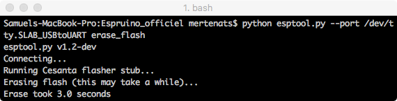
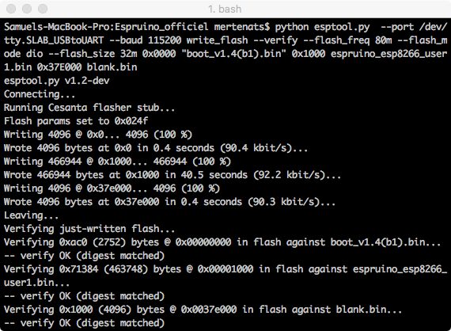
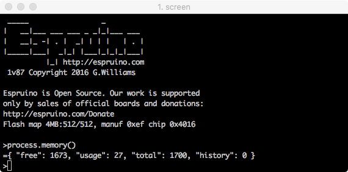
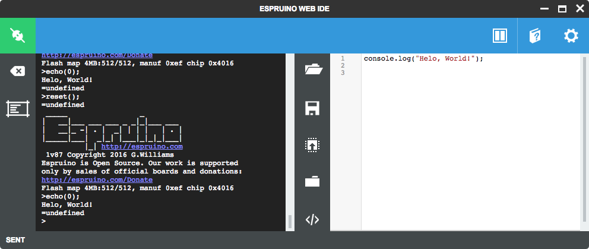

# NodeMCU with JavaScript
This repository provides a little introduction into getting going with the NodeMCU board (1.0/v2) and [Espruino](http://www.espruino.com) (JavaScript for Microcontrollers, v1.87). It provides an installation guide and some examples.

## Examples
| Title     							              	      | Description        											                              |
|-----------------------------------------------|-----------------------------------------------------------------------|
| [Hello World](01_hello_world.js)     				  | A simple **Hello World** example     					                       	|
| [Blink](02_blink_led.js)     				          | A simple example to **flash** the integrated **LED**                	|
| [Wi-Fi](03_wifi.js)     				              | A simple example to **connect** to a **Wi-Fi AP** and make the NodeMCU board available through **espruino.local**                   	|


## Installation
I spent 2-3 days to make everything working, so I decided to provide a [compressed folder](firmware/Espruino_v1_87.zip) (esptool.py v1.2 & Espruino v1.87) with everything you need to flash the firmware.

You probably need to install `pyserial` for using the `esptool.py`. It can be achieved with `sudo easy_install pyserial`(macOS), `sudo apt-get install python-serial`(Linux) or `sudo pip install pyserial`.

Move inside the downloaded folder
```
cd Downloads
cd Espruino_v1_87
```

Erase the flash memory
```
python esptool.py --port /dev/tty.SLAB_USBtoUART erase_flash
```



Flash the NodeMCU with Espruino
```
python esptool.py  --port /dev/tty.SLAB_USBtoUART --baud 115200 write_flash --verify --flash_freq 80m --flash_mode dio --flash_size 32m 0x0000 "boot_v1.4(b1).bin" 0x1000 espruino_esp8266_user1.bin 0x37E000 blank.bin
```



After flashing the firmware, you may have to unplug/plug the NodeMCU to the computer. To test the installation process, you can use `Screen` and send some JavaScript code, like `process.memory()`or `digitalWrite(NodeMCU.D4, HIGH);` to turn on the built-in led.
```
screen /dev/tty.SLAB_USBtoUART 115200
```



Launch Google Chrome, install the `Espruino Web IDE` ([extension](https://www.google.ch/url?sa=t&rct=j&q=&esrc=s&source=web&cd=2&cad=rja&uact=8&sqi=2&ved=0ahUKEwiJ-qjbsvjPAhWDnBoKHcnuAfEQFggpMAE&url=https%3A%2F%2Fchrome.google.com%2Fwebstore%2Fdetail%2Fespruino-web-ide%2Fbleoifhkdalbjfbobjackfdifdneehpo&usg=AFQjCNHyNk_XkpLYJ6DNByefI7znAP5lgg&bvm=bv.136593572,d.d2s)) and modify the Baud Rate to `115200` (Espruino Web IDE > Settings > Communications > Baud Rate).



It's possible to program the board Over-The-Air by defining a hostname and configuring a connection to it. Use the [Wi-Fi](03_wifi.js) example and add its hostname `espruino.local:23` in the configuration (Espruino Web IDE > Settings > Communication > Connect over TCP Address).

Sources
- [Run Espruino on the NodeMCU devkit](https://blog.pedesen.de/2016/06/21/run-espruino-on-the-nodemcu-devkit/)
- [Espruino Hardware Reference](http://www.espruino.com/Reference)
- [Download Espruino](http://www.espruino.com/Download)
- [CP210x USB to UART Bridge VCP Drivers](http://www.silabs.com/products/mcu/pages/usbtouartbridgevcpdrivers.aspx)
- [Esptool.py](https://github.com/themadinventor/esptool)
